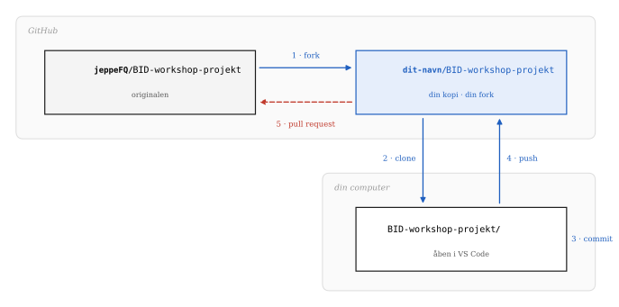

<!--- 
mkdir -p .qmd-pause && mv *.qmd .qmd-pause/ && \
  quarto add r-wasm/quarto-live; \
  mv .qmd-pause/* . && rmdir .qmd-pause
----->



## Dagens program

1. **Filsystemet**: kort genopfriskning fra lektion 1/2. Det er dét, Git holder øje med

2. **Versionskontrol**: hvad er det, og hvorfor

3. **Git i praksis**: de fem kommandoer, I skal bruge, og det samme i VS Code

4. **Fork og pull request**: at arbejde i andres kode

5. **Workshop**: I henter og tilføjer jer til vores mini-projekt, laver jeres eget repository og fortsætter med Python-øvelserne dér

# Filsystemet

## Hvad er en fil?

En sekvens af data, gemt som en samlet enhed: tekst, billeder, programmer, notebooks. Og som vi så i lektion 1, under overfladen er det hele **bytes**.

- **Filnavn og filendelse**, fx `projekt.docx`
  - basenavn: `projekt`
  - endelse: `.docx`, fortæller hvilken slags data filen indeholder, og hvilket program der skal læse den

- **Metadata**: størrelse i bytes, oprettelses- og ændringsdato, ejer og adgangsrettigheder, osv.

<br>

## Mapper er et træ

En mappe er en container til filer og andre mapper. Øverst står **roden**: `/` på macOS og Linux, et drevbogstav som `C:\` på Windows.

:::: {.columns}
::: {.column width="50%"}
**macOS**

```
/
└── Users
    └── jeppe
        ├── Desktop
        ├── Documents
        │   └── 1-bid
        │       ├── 01-variable.ipynb
        │       └── data
        │           └── salg.csv
        └── Downloads
```
:::

::: {.column width="50%"}
**Windows**

```
C:\
└── Users
    └── jeppe
        ├── Desktop
        ├── Documents
        │   └── 1-bid
        │       ├── 01-variable.ipynb
        │       └── data
        │           └── salg.csv
        └── Downloads
```
:::
::::

## Absolutte og relative stier

**Absolut sti**: fra root-mappen og hele vejen ned:

```
/Users/jeppe/Documents/1-bid/data/salg.csv
C:\Users\jeppe\Documents\1-bid\data\salg.csv
```

**Relativ sti**: fra dér, hvor man står. Står notebooken i `1-bid`, er det nok at skrive:

```
data/salg.csv
```

<br>

::: {.fragment}
Relative stier er det, der gør et projekt **flytbart**. En notebook, der læser `data/salg.csv`, virker også på en andens computer, hvis de har hentet hele mappen `1-bid`. En notebook, der læser `/Users/jeppe/…`, virker kun hos mig. Det bliver afgørende, når I deler kode via Git.
:::

## Hvor lægger I jeres filer?

<span class="timer" data-time="180"></span>

::: {.incremental}

- Hvordan ser jeres mappestruktur ud til studiet? Kan I finde en fil fra første semester på under ti sekunder?

- Hvorfor er skrivebordet et dårligt sted til et kodeprojekt?

:::

::: {.aside}
Et hint til det sidste: på mange computere bliver skrivebordet synkroniseret til iCloud eller OneDrive. En synkroniseringstjeneste og Git, der begge prøver at holde styr på de samme filer kan give nogle svært gennemskuelige problemer, der kan koste meget tid på Google/Chatten ... 
:::

# Versionskontrol

## Kender I den her?

```
/projektarbejde
└── backup
    ├── projekt_281024.docx
    ├── projekt_311024.docx
    ├── projekt_041224.docx
    ├── projekt_final.docx
    ├── projekt_final2.docx
    ├── projekt_final3.docx
    ├── projekt_final_final.docx
    └── projekt_FINAL.docx
```

::: {.incremental}

- Hvilken er den nyeste?
- Hvad er forskellen på `final2` og `final3`?
- Hvem skrev afsnit 4 om, og hvorfor?

:::

## Versionskontrol

Et system, der holder styr på ændringer i filer over tid, så man kan komme tilbage til en tidligere udgave.

Med Git kan man rulle enkelte filer eller hele projektet tilbage, sammenligne udgaver, og se hvem der ændrede hvad og hvornår (Chacon & Straub, *Pro Git*, kap. 1).

:::: {.columns}
::: {.column width="50%"}
**Før**

```
/projektarbejde
└── backup
    ├── projekt_final.docx
    ├── projekt_final2.docx
    ├── projekt_final_final.docx
    └── projekt_FINAL.docx
```
:::

::: {.column width="50%"}
**Med Git**

```
/projektarbejde
├── .git          ← hele historikken
└── projekt.docx  ← kun én fil
```
:::
::::

Tænk på det som en **fortryd-knap for hele projektet**, med en logbog over, hvem der trykkede.

## Tre måder at gøre det på

{width="95%" fig-align="center"}

::: {.incremental}

- **Lokal**: hver fil får sin historik på din egen maskine. Svært at samarbejde, og dør disken, dør historikken.

- **Central**: én server har historikken, alle andre henter derfra. Nemt at samarbejde, indtil serveren går ned.

- **Distribueret**: alle har en fuld kopi af hele historikken. Git er distribueret.

:::

## Git er ikke GitHub

:::: {.columns}
::: {.column width="50%"}
#### Git

Et **program** på jeres computer, der holder styr på historikken i en mappe.

Virker uden internet. Virker uden konto. Er gratis og open source.
:::

::: {.column width="50%"}
#### GitHub

En **hjemmeside**, der opbevarer Git-repositories og gør det let at dele dem.

Ejes af Microsoft. Der findes alternativer: GitLab, Bitbucket, Codeberg.
:::
::::

<br>

# Git i praksis

## Første gang: fortæl Git, hvem I er

Hvert commit bliver stemplet med et navn og en e-mail. Det skal sættes én gang pr. computer:

```bash
git config --global user.name "Dit Navn"
git config --global user.email "din@mail.dk"
```

Tjek, at det virker:

```bash
git config --global --list
```

<br>

::: {.aside}
Glemmer I det, afviser Git jeres første commit med beskeden *Please tell me who you are*. Brug samme e-mail som på jeres GitHub-konto, ellers kan GitHub ikke koble jeres commits til jer.
:::

## Git gemmer øjebliksbilleder med fingeraftryk

Git gemmer ikke "ændringer". Hver gang I committer, gemmer Git et **øjebliksbillede** af, hvordan filerne så ud og giver indholdet et fingeraftryk på 40 tegn.

::: {.kode-split}

```{pyodide}
#| autorun: false
import hashlib

def git_fingeraftryk(tekst):
    data = tekst.encode("utf-8")
    hoved = f"blob {len(data)}\0".encode("utf-8")
    return hashlib.sha1(hoved + data).hexdigest()

print(git_fingeraftryk('print("Første commit")\n'))
print(git_fingeraftryk('print("Første commit!")\n'))
print(git_fingeraftryk('print("Første commit")\n'))
```

:::

::: {.aside}
Det første tal er præcis det, `git hash-object` giver for en fil med den linje. Python og Git regner det samme ud, fordi det bare er matematik på bytes — alt er tal. Ét udråbstegn mere, og fingeraftrykket er helt anderledes. Derfor kan Git altid se, om noget er ændret.
:::

## Et repository

Et **repository** er en mappe, Git holder øje med. Der er to måder at få et på:

:::: {.columns}
::: {.column width="50%"}
**Start et nyt**

```bash
cd 1-bid
git init
```

Laver den skjulte `.git`-mappe. Det er dér, hele historikken bor.
:::

::: {.column width="50%"}
**Hent et, der findes**

```bash
git clone https://github.com/…
```

Henter mappen **og** hele dens historik ned på jeres computer.
:::
::::

<br>

::: {.aside}
Kør `git init` i den rigtige mappe. Kører I den i jeres hjemmemappe, begynder Git at holde øje med *alt* på computeren.
:::

## De tre stadier

{width="88%" fig-align="center"}

::: {.incremental}

- **Working directory**: den mappe, I arbejder i. Git ser, at noget er ændret, men gemmer det ikke af sig selv.

- **Staging area**: det, I har valgt skal med i næste commit. Det er en fil i `.git`-mappen, der hedder `index` — en slags "pakkeliste".

- **Repository**: når I committer, bliver det, der står på pakkelisten, en permanent del af historikken.

:::

## De kommandoer, I skal bruge

| Hvad | Terminalen | VS Code: Source Control |
|---|---|---|
| Hvad er ændret? | `git status` | listen over ændrede filer |
| Læg på pakkelisten | `git add fil.ipynb` | **+** ud for filen |
| Gem i historikken | `git commit -m "besked"` | skriv beskeden, klik **Commit** |
| Send op til GitHub | `git push` | **Sync Changes** |
| Hent andres ændringer | `git pull` | **···** → **Pull** |
| Se historikken | `git log --oneline` | **Graph** nederst i panelet |

<br>

::: {.aside}
I behøver ikke terminalen i dag: VS Code kan det hele. Men knapperne kører præcis de samme kommandoer, og når noget går galt, er det kommandoernes fejlbeskeder, I skal kunne læse.
:::

## Gode commit-beskeder

En commit-besked er en besked til jer selv om tre måneder.

:::: {.columns}
::: {.column width="50%"}
**Dårlige**

```
opdatering
rettelser
asdf
virker nu
final
```
:::

::: {.column width="50%"}
**Gode**

```
Tilføj indkomstgrænse til vurder()
Ret stavefejl i begrundelse
Tilføj test af familie D
Læs salg.csv med relativ sti
```
:::
::::

Skriv hvad commit'et **gør**, i bydeform. Én ting pr. commit.

## Notebooks og Git

En notebook er en tekstfil, men den gemmer også **output**: tal, tabeller, figurer. Kører I en celle igen, ændres outputtet og Git tror, filen er ændret.

::: {.incremental}

- Ryd output før I committer: **···** øverst i notebooken → **Clear All Outputs**

- Læg en fil ved navn `.gitignore` i roden af jeres repository. Den fortæller Git, hvad den skal lade være med at holde øje med:

:::

::: {.fragment}
```
.ipynb_checkpoints/
__pycache__/
.DS_Store
data/stor-fil.csv
```
:::

::: {.aside}
Store datafiler hører sjældent hjemme i Git. Og data om personer gør det **aldrig** — heller ikke i et *privat repository*.
:::

## Arbejdsgangen

1. `git pull`: hent de seneste ændringer

2. Arbejd: skriv kode

3. `git add`: læg ændringerne på pakkelisten

4. `git commit`: gem dem i historikken, lokalt

5. `git push`: del dem med andre

<br>

# Fork og pull request

## At arbejde i andres kode

Man kan ikke pushe direkte til andres repository. I stedet laver man en **fork** (sin egen kopi på GitHub) og beder bagefter ejeren om at trække ændringerne ind. Det kaldes en **pull request**.

Det er sådan, stort set al open source-software bliver til: tusindvis af mennesker, der aldrig har mødt hinanden, sender **pull requests** til hinandens projekter.

{width="88%" fig-align="center"}


## Fork eller clone?

| | **Fork** | **Clone** |
|---|---|---|
| Hvor sker det? | På GitHub | På jeres computer |
| Hvad får I? | En kopi under jeres egen konto | En lokal kopi af et repository |
| Hvornår? | Når I vil ændre i andres projekt | Når I vil arbejde på filerne |

<br>

I workshop-øvelsen gør I begge dele: først fork på GitHub, så clone af **jeres egen fork** ned i VS Code.

::: {.aside}
Den hyppigste fejl i dag: at clone min udgave i stedet for jeres fork. Så får I *Permission denied*, når I pusher — for I har ikke lov til at skrive i mit repository.
:::

## Det, der er offentligt, er offentligt

Workshop-projektet er et **offentligt** repository. Alt, hvad I skriver i den, kan læses af alle på internettet ... og det bliver liggende i historikken, også hvis det slettes bagefter.

::: {.incremental}

- Skriv jeres GitHub-brugernavn, ikke jeres fulde navn, hvis I hellere vil det

- Ingen CPR-numre, adresser eller telefonnumre ... **nogensinde**, i noget repository

- Et commit er ikke let at fortryde, når det først er pushet

:::

::: {.fragment}
Data, der først er delt, er svære at få tilbage. Det vender vi tilbage til.
:::

# Workshop

## Øvelse 1 (fælles)

<span class="timer" data-time="1500"></span>

Følg arket. Kort fortalt:

1. **Fork** `github.com/jeppeFQ/BID-workshop-projekt`
2. **Clone** jeres fork i VS Code
3. Kopiér `deltagere/_skabelon.md` til `deltagere/<jeres-brugernavn>.md`, og udfyld den
4. **Commit** med en god besked, og **push**
5. Åbn en **pull request** til mit repository

<br>

## Øvelse 2 (Jeres eget repository)

Det repository, I laver nu, er det, I skal arbejde i resten af kurset.

1. Lav en ny mappe, `1-bid-<brugernavn>`, og læg jeres notebooks fra sidste workshop i den

2. Åbn mappen i VS Code

3. Source Control → **Initialize Repository**

4. Tilføj en `.gitignore` med linjerne fra før

5. Første commit: `Tilføj notebooks fra Python-workshoppen`

6. **Publish Branch** → vælg **private** → VS Code opretter det på GitHub for jer

::: {.aside}
Vælg *private*. Det er jeres arbejde, og I bestemmer selv, hvem der skal se det. I kan give mig adgang under *Settings → Collaborators*, hvis I vil have feedback.
:::

